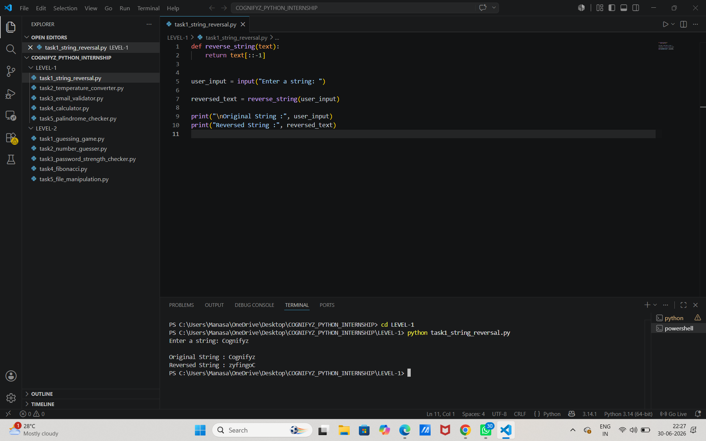
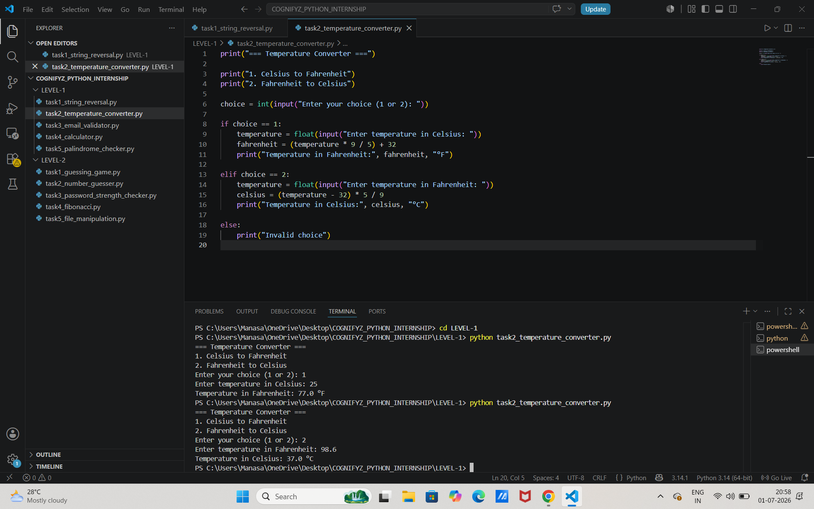
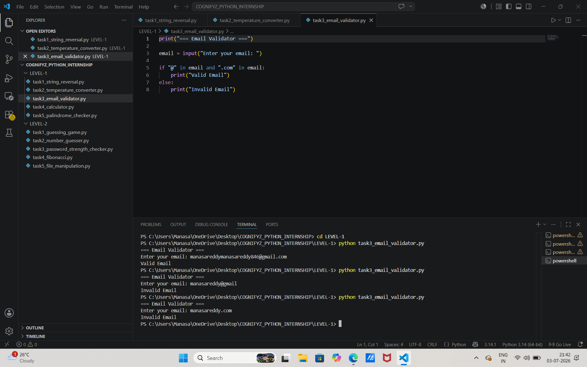
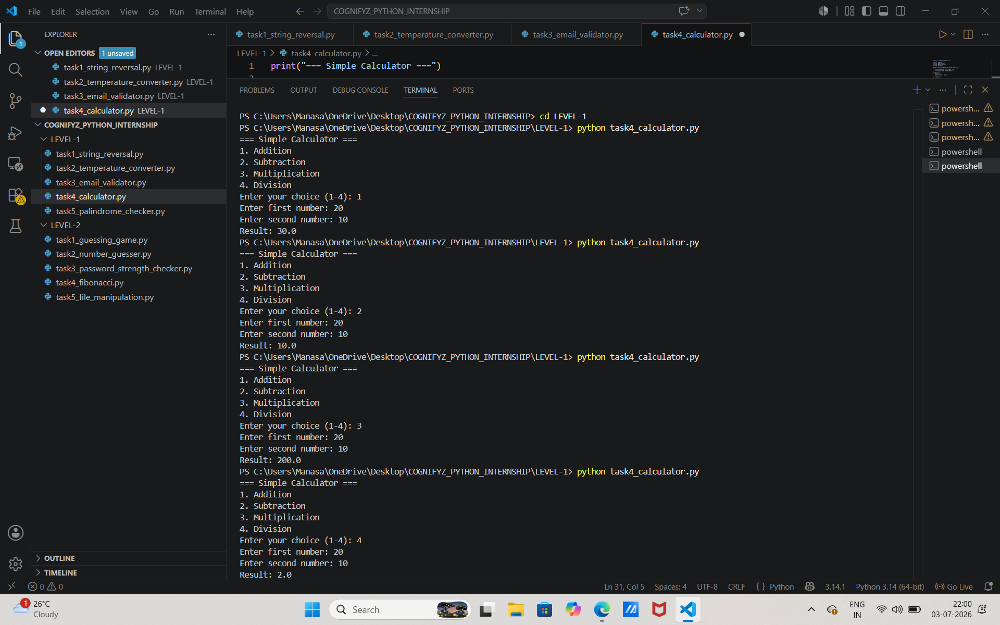
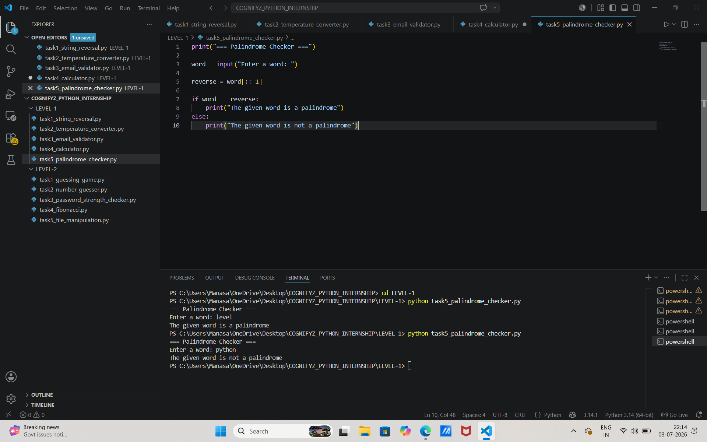
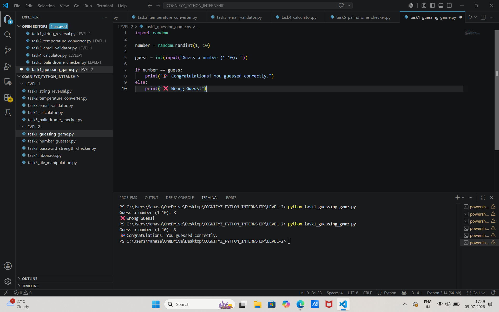
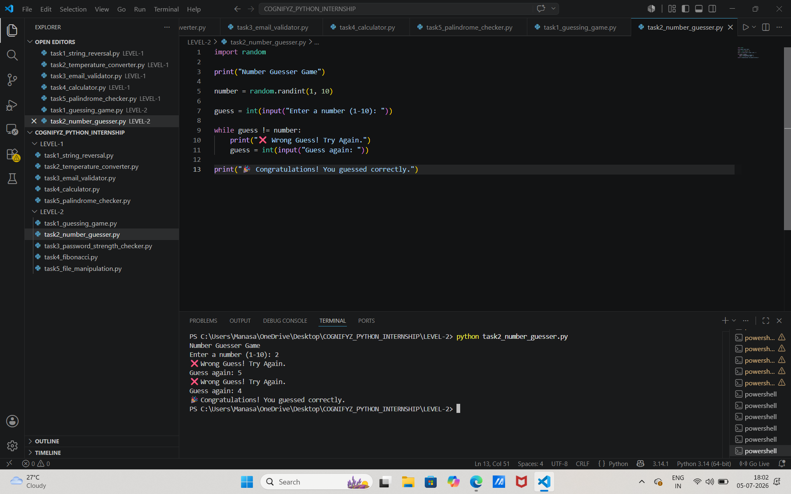
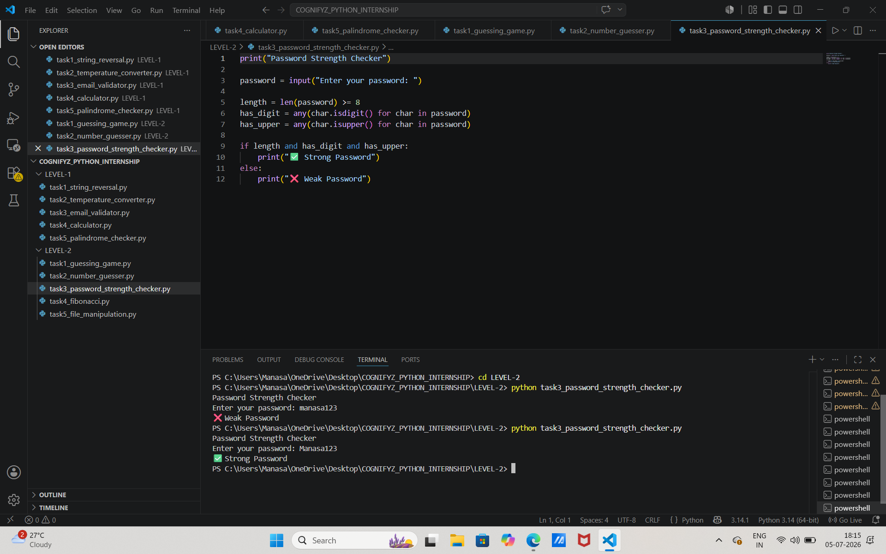
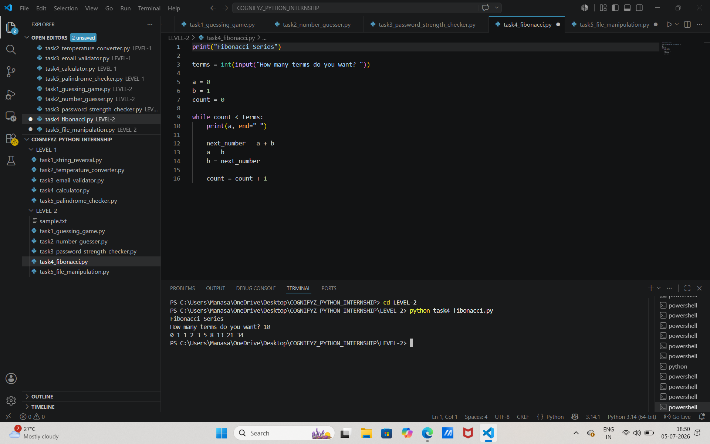
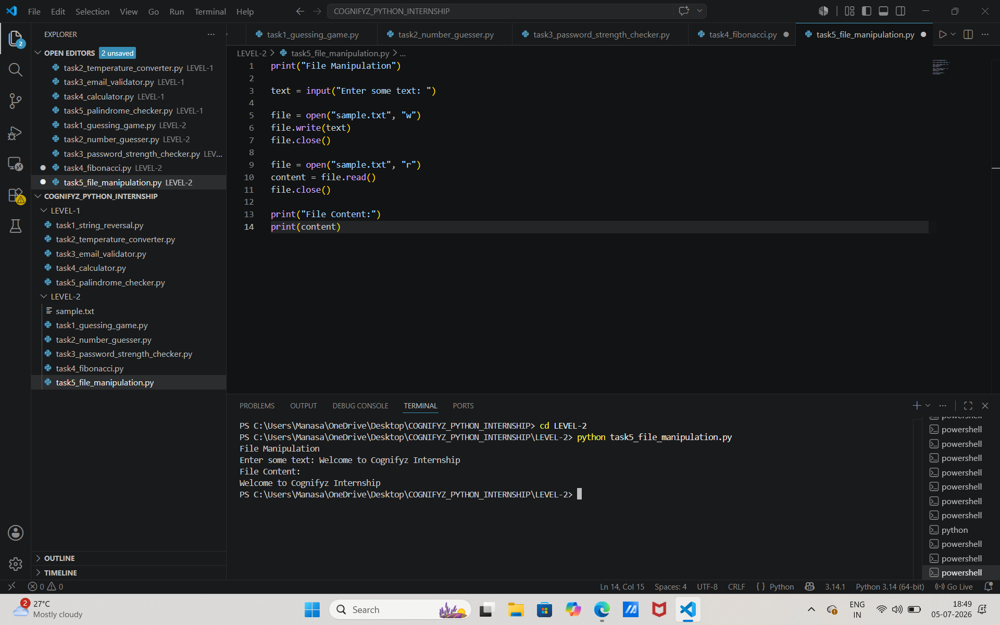

# 🐍 Cognifyz Python Development Internship

This repository contains the Python tasks completed as part of the **Cognifyz Technologies Python Development Internship**.

---

# 👩‍💻 Intern Details

- **Name:** Kalva Manasa
- **College:** St. Martin's Engineering College
- **Course:** B.Tech (Final Year)

---

# 📂 Project Structure

```
COGNIFYZ_PYTHON_INTERNSHIP
│
├── LEVEL-1
│   ├── task1_string_reversal.py
│   ├── task2_temperature_converter.py
│   ├── task3_email_validator.py
│   ├── task4_calculator.py
│   └── task5_palindrome_checker.py
│
├── LEVEL-2
│   ├── task1_guessing_game.py
│   ├── task2_number_guesser.py
│   ├── task3_password_strength_checker.py
│   ├── task4_fibonacci.py
│   └── task5_file_manipulation.py
│
├── Screenshots
│
└── README.md
```

---

# ✅ Level 1 Tasks

- String Reversal
- Temperature Converter
- Email Validator
- Calculator
- Palindrome Checker

---

# ✅ Level 2 Tasks

- Guessing Game
- Number Guesser
- Password Strength Checker
- Fibonacci Series
- File Manipulation

---

# 🛠️ Technologies Used

- Python 3
- Visual Studio Code
- Git
- GitHub

---

# 🎯 Skills Learned

- Variables and Data Types
- Conditional Statements
- Loops
- String Manipulation
- Functions
- Random Module
- File Handling
- Problem Solving

---

# 📸 Output Screenshots

## 🔹 Level 1

### Task 1 – String Reversal



---

### Task 2 – Temperature Converter



---

### Task 3 – Email Validator



---

### Task 4 – Calculator



---

### Task 5 – Palindrome Checker



---

## 🔹 Level 2

### Task 1 – Guessing Game



---

### Task 2 – Number Guesser



---

### Task 3 – Password Strength Checker



---

### Task 4 – Fibonacci Series



---

### Task 5 – File Manipulation



---

# 🙏 Acknowledgement

I sincerely thank **Cognifyz Technologies** for providing this internship opportunity. It helped me strengthen my Python programming skills through hands-on tasks and real-world problem-solving.

---

# ⭐ Thank You!

If you found this repository useful, feel free to ⭐ star the repository.